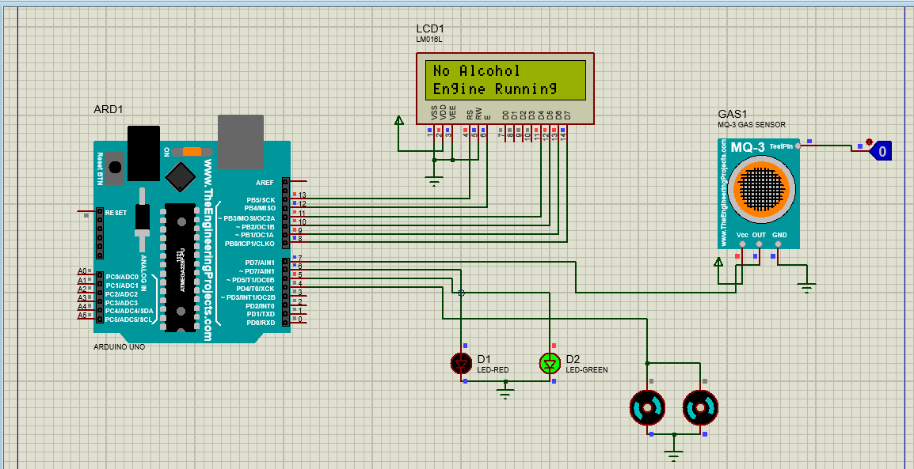
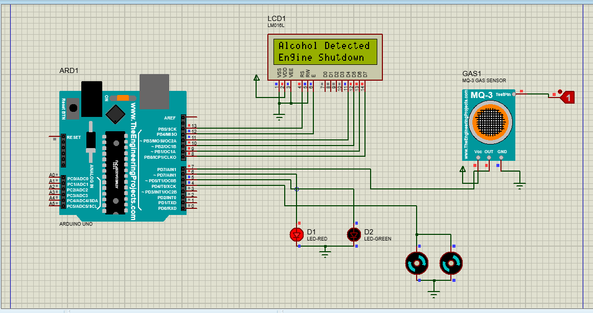
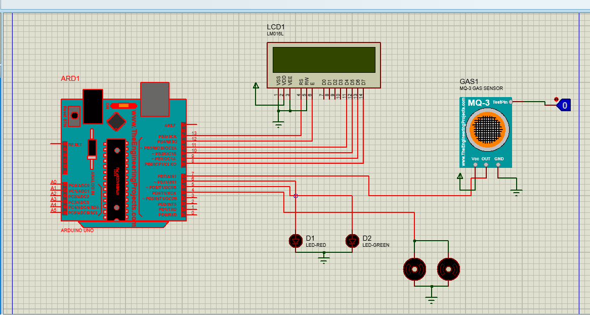

# 🚗 Alcohol Detection & Engine Shutdown System

## 📌 Project Overview
This project is an Arduino-based Alcohol Detection and Engine Shutdown System developed during my Diploma Internship.

The system detects alcohol using the MQ-3 sensor and automatically disables the engine ignition system if alcohol is detected in the driver's breath.

The complete system was designed and simulated using Proteus 8 Professional to demonstrate real-time embedded system behavior.

This project aims to improve vehicle safety and reduce accidents caused by drunk driving.

---

## ❗ Problem Statement
Drunk driving is one of the major causes of road accidents.  
This system ensures that a vehicle cannot operate if alcohol is detected, enhancing road safety through embedded system automation.

---

## 🛠 Technologies Used
- Arduino UNO
- MQ-3 Alcohol Sensor
- 16x2 LCD Display
- Red & Green LEDs
- Proteus 8 Professional
- C++ (Arduino Programming)
- Git & GitHub

---

## ⚙️ System Working

### 🟢 Before Alcohol Detection
- Green LED ON  
- Engine Running  
- LCD displays: *No Alcohol Detected*

---

### 🔴 After Alcohol Detection
- Red LED ON  
- Engine Shutdown  
- LCD displays: *Alcohol Detected – Engine Shutdown*

---

## 🖼 Circuit Diagram

---

## 🔌 Pin Configuration

| Component        | Arduino Pin |
|------------------|------------|
| MQ-3 Sensor      | D7         |
| Green LED        | D5         |
| Red LED          | D6         |
| LCD (RS, EN, D4-D7) | 13,12,11,10,9,8 |

---

## 📂 Project Structure
Alcohol_Detection_System/
│
├── code/
│ └── Alcohol_Detection.ino
│
├── simulation/
│ ├── Alchol_Final.pdsprj
│ ├── circuit.png
│ ├── before_detection.png
│ └── after_detection.png
│
└── README.md

---

## 🚀 Key Features
- Real-time alcohol detection
- Automatic engine shutdown logic
- LCD status monitoring
- Visual indication using LEDs
- Embedded system simulation using Proteus
- Internship-based hardware-software integration project

---

## 🎯 Applications
- Vehicle safety systems
- Anti-drunk driving prevention
- Automotive embedded safety solutions
- Educational embedded system demonstrations

---

## 👨‍💻 Author
**Prathamesh**  
Diploma Engineering Student  

This project was developed during my internship as part of an embedded systems safety solution using Arduino-based C++ programming and Proteus simulation.

---

## 📌 Future Improvements
- GSM alert notification system
- GPS-based vehicle tracking
- IoT-based remote monitoring dashboard
- AI-based driver monitoring system
- Real hardware prototype implementation